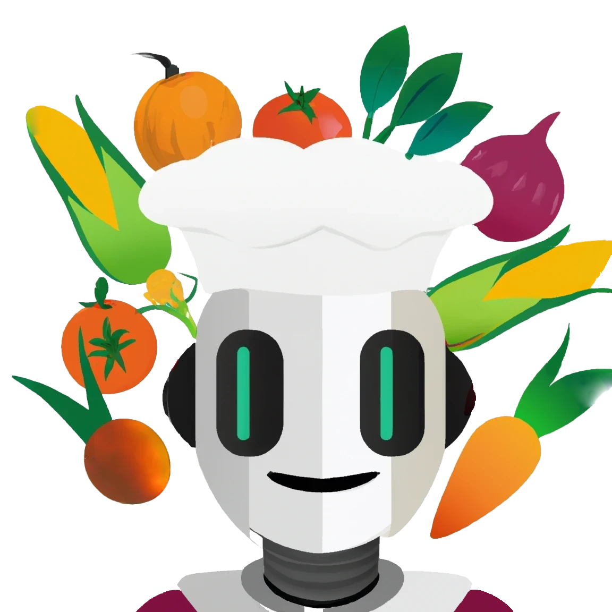

<a name="readme-top"></a>
<!--
*** Based on Best-README-Template.
-->


<!-- PROJECT LOGO -->
<br />
<div align="center">
  <a href="https://github.com/othneildrew/Best-README-Template">
    
  </a>

  <h3 align="center">RecipeGPT</h3>

  <p align="center">
    Easily find recipes based on what ingredients you have at home! Inspired by <a href = "https://jainrecipes.github.io/">JainRecipes!</a>
    <br />
  </p>
</div>


<!-- TABLE OF CONTENTS -->
<details>
  <summary>Table of Contents</summary>
  <ol>
    <li>
      <a href="#about-the-project">About The Project</a>
      <ul>
        <li><a href="#built-with">Built With</a></li>
      </ul>
    </li>
    <li>
      <a href="#getting-started">Getting Started</a>
      <ul>
        <li><a href="#installation">Installation</a></li>
      </ul>
    </li>
    <li><a href="#license">License</a></li>
  </ol>
</details>


<!-- ABOUT THE PROJECT -->
## About The Project

RecipeGPT is a project that can create recipe recommendations. Using Flask and an available Hugging Face GPT-2 Model that was trained on the RecipeNLG dataset, RecipeGPT will both provide the recommended JainRecipes along with an assortment of GPT-2 generated recipes. Users will be able to select what ingredients they have at home from a comprehensive list scraped from JainRecipes and will be provided with a personalized culinary recommendation.

[![RecipeGPT Demo][demo-screenshot]](https://youtu.be/z_MJli3wCtY "RecipeGPT Demo")


<p align="right">(<a href="#readme-top">back to top</a>)</p>


### Built With

* [![Python][Python.com]][Python-url]
* [![Flask][Flask.com]][Flask-url]
* [![Bootstrap][Bootstrap.com]][Bootstrap-url]
* [![Huggingface][Huggingface.com]][Huggingface-url]

<br><br>
Relevant libraries include:
- flask
- json
- Levenshtein/fuzz (for similar string identification)
- transformers/hugingface (for the gpt-2 model)
- re
- BeautifulSoup
- markdown
- datetime
- random
- os/dotenv
- requests
- time


<p align="right">(<a href="#readme-top">back to top</a>)</p>


<!-- GETTING STARTED -->
## Getting Started

### Installation

To setup on your local machine

1. Generate a GitHub Access Key (needed to scrape JainRecipes) & a Spoonacular API key if you wish to use spoonacular for image/recipe link generation
2. Clone the repo
   ```sh
   git clone https://github.com/JainRecipes/RecipeGPT.git
   ```
3. Install all prerequisites (requirements.txt has all pip libraries and extras from other projects I have worked on)
   ```sh
   pip install -r requirements.txt
   ```
4. Enter your API in `.env`
   ```js
   GITHUB_ACCESS_TOKEN = 
   SPOONACULAR_API_KEY = 
   ```
5. Run the app
```sh
python app.py
```
<p align="right">(<a href="#readme-top">back to top</a>)</p>


<!-- LICENSE -->
## License

Distributed under the MIT License. See `LICENSE.txt` for more information.

<p align="right">(<a href="#readme-top">back to top</a>)</p>

Credit to Pratul Tandon for training the GPT-2 model for recipe generation based on the RecipeNLG dataset. More info here
https://huggingface.co/pratultandon/recipe-nlg-gpt2


[license-shield]: https://img.shields.io/github/license/JainRecipes/RecipeGPT
[license-url]: https://github.com/JainRecipes/RecipeGPT/blob/main/LICENSE

[linkedin-shield]: https://img.shields.io/badge/-LinkedIn-black.svg?style=for-the-badge&logo=linkedin&colorB=555
[linkedin-url]: https://www.linkedin.com/in/rishabhj0/


[Bootstrap.com]: https://img.shields.io/badge/Bootstrap-563D7C?style=for-the-badge&logo=bootstrap&logoColor=white
[Bootstrap-url]: https://getbootstrap.com

[Flask.com]: https://img.shields.io/badge/Flask-66ffcc?style=for-the-badge&logo=flask&logoColor=black
[Flask-url]: https://flask.palletsprojects.com/en/2.3.x/

[Python.com]: https://img.shields.io/badge/Python-FFD343?style=for-the-badge&logo=python&logoColor=black
[Python-url]: https://www.python.org/

[product-gif]: static/media/RecipeGPTDemo.gif
[demo-screenshot]: static/media/RecipeGPTScreenshot.png

[huggingface.com]: https://img.shields.io/badge/HuggingFace%20GPT2%20Model-FFA500?style=for-the-badge&logo=huggingface&logoColor=black
[huggingface-url]: https://huggingface.co/pratultandon/recipe-nlg-gpt2
